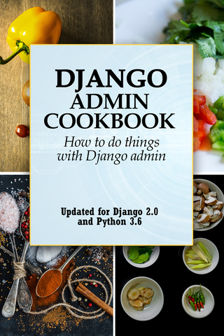
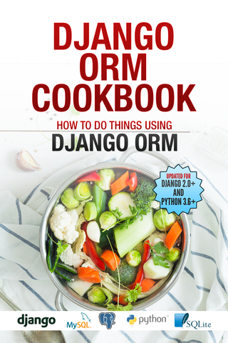
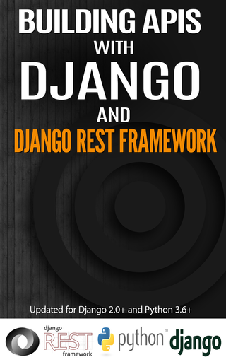
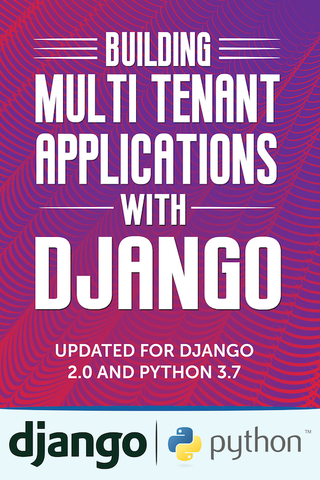

Books by Agiliq
==========================

- `Django Admin Cookbook (Django 2.0) <https://books.agiliq.com/projects/django-admin-cookbook/>`_
- `Django ORM Cookbook (Django 2.0) <https://books.agiliq.com/projects/django-orm-cookbook/>`_
- `Building APIs with Django and Django Rest Framework (Django 2.0) <http://books.agiliq.com/projects/django-api-polls-tutorial/>`_
- `Building Multi Tenant Applications with Django (Django 2.0) <https://books.agiliq.com/projects/django-multi-tenant/>`_
- `Django Design Patterns (Outdated) <https://books.agiliq.com/projects/django-design-patterns/>`_
- `Django Projects Cookbook (Django 2.0) <https://books.agiliq.com/projects/djenofdjango/>`_
- `Software consulting Howto (2011) <https://www.agiliq.com/softwareconsulting/>`__
- `Visual Arts with Python (Python 3.6) <https://books.agiliq.com/projects/Visual-Arts-with-Python/>`_
- `Journeyman Python (Python 3.6) <https://books.agiliq.com/projects/Journeyman-Python/>`_
- `Django Gotchas (Outdated) <http://books.agiliq.com/projects/django-gotchas/>`_

Django Admin Cookbook
++++++++++++++++++++++++++++++++++++++++++++++

Django Admin Cookbook is intermediate level book about doing things with Django Admin, written in a question and answer style.

`Read Django Admin Cookbook <https://books.agiliq.com/projects/django-admin-cookbook/>`_

----------

Django ORM Cookbook
++++++++++++++++++++++++++++++++++++++++++++++

Django ORM Cookbook is a book about doing things with Django ORM and Django models. Django is a “MTV” (Model-Template-View) framework – This book provides a deep dive into the :code:`M` part.

`Read Django ORM Cookbook <https://books.agiliq.com/projects/django-orm-cookbook/>`_

----------

Building APIs with Django and Django Rest Framework
+++++++++++++++++++++++++++++++++++++++++++++++++++++
Building APIs with Django and Django Rest Framework rewrites the beginner Django polls app to an API format using Django Rest Framework.

`Read Building APIs with Django and DRF <http://books.agiliq.com/projects/django-api-polls-tutorial/>`_

----------

Building Multi Tenant Applications with Django
+++++++++++++++++++++++++++++++++++++++++++++++++++++
Building multi tenant applications with Django teaches how to build multi tenant apps and the various approaches to multi tenancy. In this book, you will rebuild the same app using the various methods to achieve multi-tenancy.

`Read it here <https://books.agiliq.com/projects/django-multi-tenant/>`_

Software consulting Howto
++++++++++++++++++++++++++

A book about setting up and running a well oiled software consulting business. Written in 2011.

Visual Arts with Python
+++++++++++++++++++++++

Let us make some beautiful things with Python.

`Read Visual Arts with Python  <https://books.agiliq.com/projects/Visual-Arts-with-Python/>`_

Journeyman Python
+++++++++++++++++++

Learn advanced Python by reading code of well engineered software.

`Read Journeyman Python <https://books.agiliq.com/projects/Journeyman-Python/>`_

Django Projects Cookbook
++++++++++++++++++++++++++++++++++++++++++++++

A Django book which teaches advanced Django concepts by building real Django projects.

- `Read Django Projects Cookbook <https://books.agiliq.com/projects/djenofdjango/>`_

Django Design Patterns
++++++++++++++++++++++++++++++++++++++++++++++
Django design patterns is a book about commonly occurring patterns and best practices in Django.

Django Gotchas
++++++++++++++++++++++++++++++++++++++++++++++

A book about common mistakes people make while programming with Django
